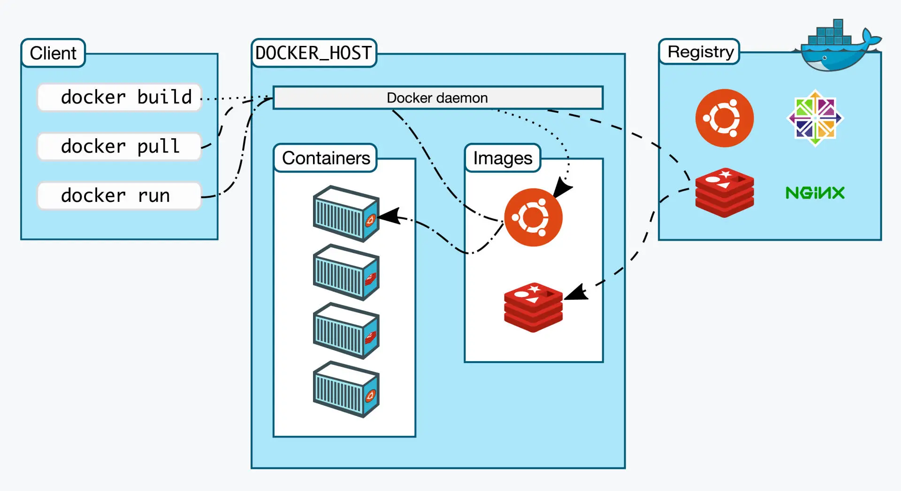

# docker 的基本概念

docker项目 的基本架构

从图中我们知道，我们平时操控的 docker 只是 docker 的client 部分，然后由 client 向 docker 的后台 docker daemon发送命令，真正控制的是 docker daemon，这这种架构是我们常见的客户端/服务器（cs）架构，这样的架构可以最大限度的去保护系统的核心部位。

下面是docker的整体运作模式

1. 用户使用 docker client 去向 docker daemon 请求命令
2. docker daemon 从远程服务器 Registry 获取镜像
3. docker daemon 将镜像下载到本地以后，生成并管理容器

