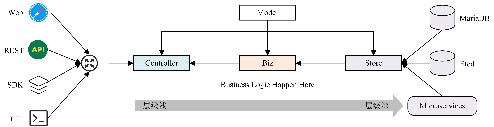

<!--
 * @Author: shgopher shgopher@gmail.com
 * @Date: 2025-07-20 11:12:23
 * @LastEditors: shgopher shgopher@gmail.com
 * @LastEditTime: 2025-07-22 10:43:21
 * @FilePath: /luban/架构分类/分层架构/clean/README.md
 * @Description:y
 * 
 * Copyright (c) 2025 by shgopher, All Rights Reserved. 
-->
# clean 架构

clean 架构的核心是一种更严格、更解耦、更以业务核心为中心的传统分层架构的演进形式，通过强制性的单向依赖规则 (指向内层) 和依赖倒置原则的广泛应用，解决了传统分层架构中业务逻辑与技术实现耦合过紧的问题，极大地提升了系统的可维护性、可测试性和框架/技术栈的无关性。

## Clean 架构的核心原则
- 业务逻辑是核心：最内层是独立的、不依赖任何外部框架或细节的业务实体 (Entities) 和业务规则 (Use Cases)。

- 依赖向内：外层 (具体实现) 依赖内层 (抽象接口)。数据库操作、Web 框架、UI 等都是外层，它们实现内层定义的接口。

- 抽象在内层：内层定义接口 (例如 IUserRepository，IOrderService)，规定需要什么操作 (如 SaveUser，GetOrderById)。

- 具体实现在外层：外层提供这些接口的具体实现 (例如 MySQLUserRepository，RESTOrderService)。数据库访问代码、API 调用代码等就写在这些外层实现类里。

