<!--
 * @Author: shgopher shgopher@gmail.com
 * @Date: 2024-11-25 20:50:03
 * @LastEditors: shgopher shgopher@gmail.com
 * @LastEditTime: 2024-11-27 23:00:05
 * @FilePath: /luban/系统设计基础/分布式/分布式关键技术/服务发现/README.md
 * @Description: 
 * 
 * Copyright (c) 2024 by shgopher, All Rights Reserved. 
-->
# 服务发现

在微服务的分布式系统机构下，我们强调服务而非类库，因为类库之间是强耦合的，而服务之间存在物理上的间隔关系。

微服务获得了巨大的收益的同时也有着巨大的挑战，各个服务之间如何发现对方？外部的服务由谁提供？内部哪些服务需要暴漏？如何做到各个服务之间均衡的调用？

其实最简单的服务发现就是 DNS 系统，我们要访问的是一个 URL，但是计算机只认识 IP 地址，这里就是一个服务发现的过程。

通常我们通过远程调用的方式调用其他的服务，我们通过**全限定名，端口，服务标识**来**精确**的调用具体的服务。

**服务发现的技术原理并不复杂，一般通过一个服务注册中心来实现，注册中心主要负责两件事，管理每一个服务的地址列表 (服务注册)，将某个服务的具体地址告知调用者 (服务发现)**

还可以采取订阅发布模式获取服务的变化：

目前业内的注册中心有：Consul，Nacos 等

由于注册中心并不依赖任何的服务，但是所有服务都要仰仗注册中心，所以注册中心必须使用集群的方式去提供服务来避免**单点故障**。
## 注册中心的实现原理
- 分布式 K/V 存储框架衍生的注册中心，比如 etcd zookeeper，doozerd，这种方式需要二次开发，相对来说更为复杂，除非你需要定制化的操作，否则不推荐这种复杂的方法。
- 以基础设施来实现的注册中心，SkyDNS、CoreDNS，其中 k8s 1.3 版本之前使用 skyDNS 作为默认的 DNS 服务器，1.3 版本之后改为 CoreDNS，是 CP 还是 AP 就取决于后端采用何种存储，如果是基于 Etcd 实现的，那自然是 CP 的，如果是基于内存异步复制的方案实现的，那就是 AP 的
- **专门用于服务发现的框架和工具**，这类的代表是 Eureka、Consul 和 Nacos。这一类框架中，你可以自己决定是 CP 还是 AP，比如 Nacos 它用了两种共识算法去实现，当你使用 raft 的时候，那么自然是 CP，如果采用自研的 Distro 协议做的，就是 AP 了。
## 可用地址管理
> 服务实例的概念：服务实例指的是一个服务的具体运行实体，它是服务代码被加载、运行并对外提供服务能力的一个独立单元。可以类比为现实生活中一家连锁品牌店的某个具体门店，品牌店整体可以看作是一个服务，而每个实际存在、能接待顾客的门店就是这个服务的一个实例。比如 docker 有多个服务，你下载了某个服务去下载然后配置安装到具体的容器中，这个容器中的就是一个运行的实例，这个 docker 服务就是一个服务。

- 主动探活：服务中心周期性的向每一个注册的服务地址去发送请求，不过仅仅适用于服务较少，实例较少的产品后台

- 心跳探活：服务实例在启动时，会主动向注册中心注册自己，并定期向注册中心发送心跳，如果服务实例在注册中心没有心跳，则注册中心会主动将服务实例从注册中心中移除。

当注册中心通过主动或者心跳探活的方法无法探测到服务实例，则注册中心会主动将服务实例从注册中心中移除。

不过，由于删除服务是一个非常重要的操作，所以我们应该加上预警机制，**当拆除的服务实例超过一定数量时，应该发出预警，让管理员尽快处理。**
## 地址变更推送
当服务的地址列表发生变更时，服务中心需要主动推送最新的地址给调用者，但是这个时候非常容易遇到推送爆炸的情况，如果某个服务有 100 个调用者，每个调用者又有 100 个实例，那么要推送的节点数字就是 10000，如果多个地址发生变更呢？

我们用下面几种优化方法
- 推送增量数据，而不是全量数据，比如推送 xx 新增，xx 废弃，而不是一次推送全部的地址给节点，这有点像系统更新时的更新介绍，只介绍改变的部分即可

- 注册中心作为一个服务，要摒弃单点模式，创建多个注册中心的实例，使用一定的分片算法，让每个实例只负责一部分服务，当然，为了高可用你也可以使用多主的模式，这样每个分片的区域都是一个小的集群，这样当某个服务发生变更时，就只通知负责该服务的注册中心，并且该注册中心也实现了高可用，这样避免了推送的爆表，也避免了注册中心的单点宕机问题。

- 推拉结合的方法，注册中心只主动推送 N 个调用节点，没有被推送的就周期性的主动拉取数据更新。