# Paxos

Paxos 算法是一种非拜占庭将军问题共识算法 (故障容错共识算法)，它是现代多种故障容错算法的鼻祖，比如 Fast Paxos，Cheap Paxos，Raft，ZAB 等。

paxos 分为 basic paxos 算法，它描述的是多节点之间就某个值达成共识；以及 Multi-Paxos 算法，描述的是执行多个 basic paxos 实例，一系列值达成共识。

在 basic paxos 中有三个角色：
- 提议者 (proposer)，集群中，收到客户端请求的节点是提议者，他**提出**对某个值进行**设置**操作，设置这个值的行为称之为提案，值一旦设置成功，就是不会丢弃也不会改变的，***设置值，你可以理解为日志记录操作，而不是赋值***
- 接受者 (acceptor)，应答提案的节点，决定该提案是否可被投票，是否可被接受，提案一旦得到过半决策节点的接受，就说明该提案被批准了，提案被批准就意味着该值不能被修改更不会丢失并且最终所有的节点都会接受该值
- 学习者 (learner)，被告知投票的结果，不参与投票的过程，一般是数据备份的节点。比如传统的主备方案中，备份节点就是学习者，它不参与共治。比如少数节点从网络分区中恢复的时候，它将会进入这个学习者的状态。

提议者代表的是接入和协调功能，收到客户端的请求后**发起**二阶段的提交这一事件，进行共识协商。

接受者，代表投票和存储数据，对提议的**值**进行投票，并接受达成共识的值，并存储值。

学习者代表存储数据，**不参与协商**，只接受达成共识的值。

在使用 paxos 算法的分布式系统中，所有节点均平等，他们都是身份的转变，比如提议者也好，接受者也好，**都是一种身份的转变，他们可以转变身份**，为了确保有明确的多数派，所以决策节点的数量应该设置为奇数，并且在系统初始化的时候，网络中每一个节点都知道整个网络中所有决策节点的数量和地址

在分布式环境中，如果说各个节点就某个值达成一致，指的是，不存在某个时刻一个值是 A，另一个时刻又是 B，这是因为：

1. 系统内部各个节点通信是不可靠的，不论是提案节点亦或者是决策节点，都可能会数据丢失，发送收到的延迟
2. 系统外部的用户访问是并发的

我们看第二个问题，集群外部是并发访问的，因此我们是一定要加锁的，即便不是分布式的系统架构是单体系统中，只要有并发操作了，加锁一定是不可避免的行为，因此，分布式也需要加锁，而且我们还要考虑到节点的通信故障，因此如果在锁加锁状态未能释放就会造成无限的阻塞，所以我们要在分布式系统中添加一个抢占式的锁机制。

basic paxos 算法分为两个阶段，准备和提案对吧，**准备这个阶段就是分布式抢占加锁的过程**，如果某个提案节点准备发起提案，它必须向所有的决策节点广播一个许可申请，prepare 请求，提案节点会附加上一个全局唯一 id N 作为提案的 id，决策节点收到请求之后会做出两个承诺和一个应答。

承诺：
1。不会接受提案 ID 小于等于 N 的 prepare 请求
2。不会接受提案 ID 小于 N 的 Accept 请求

应答：
1。不违背之前的承诺前提下，回复已经批准过的提案 ID 最大的那个提案所设定的值和提案 ID，如果该值没有被任何提案设定，就返回空值，如果收到的提案 ID 并不是决策节点收到的最大的，那么该 prepare 不予理会。

当提案节点收到了多数决策节点的应答之后，开始第二阶段的 accept 过程：
1。如果提案节点发现所有响应的决策节点此前都没有批准过任何的值 (空)，那么说明是设置的第一个值，那么提案节点将自己选定的值和提案 id 设置为 (id，value) 再次广播给全部的决策节点
2。如果提案节点发现响应的决策节点中已经至少一个节点的应答 (promise) 中包含了值，那么它就不能随意取值，必须从应答的节点中找到提案 id 最大的那个值并且接受，构成一个二元组 (id，maxAcceptValue) 再次广播给全部的决策节点

当每一个的决策节点收到 Accept 请求的时候，都会在不违背以前做出的承诺的前提下，接受并且持久化对当前提案的 ID 和提案附加的值

当提案节点收到了多数决策节点的应答 (Accept 应答) 后，协商结束，你可以理解为加锁结束，共识决议形成，这里大多数应答就可以了，**即便是某些节点没有完成同步，在后面的再次提案过程中也会有提案 id 去把控数据**，共识决定形成之后，会把数据发送给所有的记录节点去学习。

### 实操
假设一个分布式系统有五个节点 s1 s2 s3 s4 s5，仅讨论正常的通信过程，不考虑网络分区，现在有两个写入的请求，分别是 x，y，主要作用在 s1 和 s5 上，让我们分情况讨论

- 情况一，s1 的提案 id 是 3.1，现取得了多数节点的 Promise 和 Accepted (就是本身是空的情况) 它将数据设置为了 x，然后这时，s5 发起 4.5 的 prepare 请求，它收到的回应中肯定有 x 的值，所以 s5 这个提案就不能使用它的 y 值了，必须使用 x，那么本情况下所有节点的值就应该是 x
- 情况二，s5 发起 4.5 prepare 请求的时候，s1 的提案尚未完成接受的整个过程，但是只要有一个节点完成了 promise 应答，就可以将 s5 的提案设置为 x
- 情况三，s1 有了 accept x，但是当 s5 发起 4.5 的 prepare 请求时，它没有任何一个节点返回具体的应答，s2 s3 虽然有了 promise 此时它还没有 accept，s5 用更大的 id 获得了 s3 s4 s5 的 promise，这三个节点并未 accept 任何数据，所以 s3 已经无法 accept s1 发送的 x 数据了，因为更新的 id 出现了，所以整个系统最终的结果就是 y
- 情况四，如果两个提案节点交替使用更大的提案 id 让 prepare 阶段成功，就是返回 promise 成功，但是都无法 accept 数据，那么这个过程将无法停止，形成 live lock，所以我们要在这个过程中**引入超时**
## multi-paxos
在 basic paxos 中因为节点没有主次之分，所以当不同的节点充当提议者的时候非常容易出现两个提案节点互不相让争先提出自己的提案，抢占同一个值的修改权限，导致整个系统反复横跳，所以 multi paxos 提出了不破坏 basic paxos 中众生平等的原则，然后又能在提案节点中实现主次的方法。

multi paxos 的改进是增加了**选举过程**，只有主节点才有提出方案的权利，从节点只能参与投票，投票是否赞成主节点提出的值，因此***无论是哪个节点得到请求，都必须将数据转发给主节点来完成提案***

提案节点通过心跳信号的方式确定当前的网络中所有节点是否存在一个主节点，如果没有主节点，那么就会通过传统的 basic paxos 的二次商议的方式去选举出一个主节点

主节点提出的议案无需二次请求，也就是准备和接受，主节点只需要让从节点接受即可，即发出 accept 数据，收到 accepted 数据的通知。

我们要给主节点增加一个任期编号，而且必须是单调递增的，一旦主节点陷入宕机之后，即便重新恢复了，只要选出了新的主节点，那么这个老主节点就自然变成了从节点，我们按照编号最大的主节点为真正的主节点。

那么 multi paxos 的三个核心问题就变成了
1。leader 选举制度
2。如何把数据复制到各个节点上
3。如何保证过程安全

