<!--
 * @Author: shgopher shgopher@gmail.com
 * @Date: 2024-11-02 22:37:04
 * @LastEditors: shgopher shgopher@gmail.com
 * @LastEditTime: 2024-11-13 00:10:37
 * @FilePath: /luban/系统设计基础/分布式/分布式算法/raft/README.md
 * @Descripti
 * 
 * Copyright (c) 2024 by shgopher, All Rights Reserved. 
-->
# raft

raft 是一种 multi paxos 算法。

basic paxos 麻烦的一批，而且有很多的问题，根本无法推进到实战中，所以我们在使用强一致性方案的时候通常首选的是 multi paxos 类算法，raft 算法就是一种 multi paxos 算法，并且是强一致性共识算法中的首选。

在 raft 中角色有三个
- 领导者 (一个 raft 集群中仅有一个领导者)
- 跟随者
- 候选人

有领导的时候就是领导和跟随者的关系，领导死了，谁选上了就又变成了领导，所以同时存在的关系最多只有两个，情景一【领导者-跟随者】，情境二【候选人-跟随者】。

**raft 算法通过一切以领导者为准的方式实现一系列值的共识和各个节点日志的一致。**
## 领导选举
在初始阶段，所有节点都是跟随者的状态。

在初始阶段，raft 系统会给所有跟随节点赋予一个**随机的**超时时间，比如
- 节点 A，任期编号 0，超时时间 100ms
- 节点 B，任期编号 0，超时时间 200ms
- 节点 C，任期编号 0，超时时间 300ms

每个节点**等待领导节点心跳信号的超时时间是随机的**，一旦没有这个信号之后，它就发生了超时，这个时候，超时时间最短的节点 (这里是 A 节点) 就会**增加自己的任期，并推举自己为候选人，并且先给自己投出一票，然后给其他节点发送投票的 RPC 消息**请求他们投自己为领导人

那么这个状态就是下面这个示意图：

当其它节点接收到候选人 A 的请求投票的 RPC 信息之后，在编号为 1 的任期之内还没有进行过投票，那么它就会把票投给节点 A，然后增加自己的任期编号

如果这个候选人赢得了大部分的选票，那么它就是**本届的**领导人

这个时候，领导人会发送心跳信号 (周期性的信号) 来通知其它的节点，不要篡位，阻止他们发起新的选举。

### 节点之间的通讯
- 请求投票 RPC，**候选人**在选举环节发起，通知各个节点投票
- 日志赋值 RPC，***领导人***发起，复制日志，提供心跳信号

### 任期

任期是单调递增的标识符，比如 1，23，3333

- 跟随者在等待领导人信号超时并且提举自己为候选人的时候，会增加自己的任期
- 如果一个节点发现自己的任期编号比别的节点的小，那么它会更新自己的编号到较大的编号，比如 B 节点接到了 A 节点的候选人投票请求时，发现自己的编号是 0，而 A 已经是 1 了，那么它就会增加自己的编号到 1

**1。raft 算法中，如果一个候选人或者领导者发现自己的编号小于其它的编号，那么它会立刻切换为跟随者的角色。**

比如一个领导节点挂了，别的节点已经选举过了，它自己是 1，那么它接受到了领导节点编号为 2 的节点的心跳信号，或者是选举人的选举信号，那么它立刻就切换身份到跟随者的身份。

**2。如果一个节点收到了一个较小任期编号的请求，它会直接拒绝该请求**

比如节点 C 任期是 10，它收到了任期为 1 的请求投票 RPC 请求，它将直接拒绝这个请求

### 选举规则
- 领导者周期性的向所有跟随者发送心跳信号，该信号不包括日志复制的命令，仅通知领导者的存活
- 跟随者一定时间内没有接收到领导者的心跳信号，就推举自己为候选人
- 在一次选举中，赢得大多数选票的候选人晋升为领导人
- 在一个任期内，领导人一直都是领导人，除非发生事故 (比如本身节点宕机，或者网络出现延迟)，其它节点发起新的领导人选举
- **每一个服务器节点最多会对一个任期的编号投出一张票**遵循先来后到的原则
    

- 日志完整性高的跟随者拒绝投票给日志完整性低的候选人
    
- 候选人选举成功要求获得大多数选票，一般是半数以上，当然你可以自己制定
- 为了避免同一任期内多个候选人的出现，我们一般要设置一个随机超时时间
### 随机超时时间
为了避免出现过多的候选人，避免未达到过半或者指定比例的选举结果，raft 算法将超时时间分散排布，大多数情况下只有一个候选人

- 跟随者等待领导者心跳信号的超时时间是随机的
- 当没有候选人赢得过半票选时，选举无效，**等待选举的这个等待的超时时间段，每一个节点也是随机的**，假设集群中有 5 个节点，在第一轮选举中，3 个节点收到投票请求，但是没有一个候选人获得 3 票 (多数票)。选举超时后，符合条件的节点会再次发起投票请求，开始下一轮选举，直到有一个候选人获得多数票，**此时任期编号会增加**
### Raft 和传统 multi paxos 的区别
- raft 并不是所有节点都可以当选领导者，multi paxos 是所有节点都有选举的权利，在 raft 中只有日志最完整的节点才能当领导者，因为你日志不完整，别人都会拒绝给你投票
- raft 中日志必须是连续的
- 在 Raft 中，日志不仅是数据的载体，日志的完整性还影响领导者选举的结果。也就是说，日志完整性最高的节点才能当选领导者。
### raft 集群提供服务的方式

- **读写都由领导节点提供服务**：在 Raft 算法中，领导节点是唯一能够接受并处理客户端的写操作的节点。追随者节点 (从节点) 主要负责同步和备份日志数据，以保证集群的一致性。
- **写由领导节点提供服务，读可由领导和追随者节点提供**：在某些配置下，可以允许追随者节点处理只读请求以分担领导节点的负载。此时，追随者节点能够服务于客户端的读需求。但对于写操作，追随者节点不会直接处理，而是将这些写请求转发给领导节点进行处理。
## 日志复制
raft 算法中，副本的数据是以日志的形式存在的。

什么是日志呢？举个例子，你在往计算机中录入 Excel 数据，别人递给你的临时写在纸上的草稿就是日志，日志上的数据也是持久化的，也不会丢失，但是，它没有规规矩矩的存放，属于临时性的草稿。

当 raft 中的领导者收到来自客户端的写请求时，领导节点存储数据，并且复制数据发起 RPC 请求，发送数据给随从节点，随从节点接受数据然后提交该日志项。

如果领导者接收到**大多数的 “【复制成功】” 响应后，它将日志项提交到它的状态机，**，(***请注意这里只是让从节点复制成功，并没有写入从节点的日志项呢***) 并
返回成功给客户端。如果领导者没有接收到大多数的 “复制成功” 响应，那么就返回错误给
客户端

为什么领导节点将日志项提交到状态机了之后，不通知从节点该复制的数据通过整体投票正式写入日志这个通知呢？

因为领导者的**日志复制 RPC 消息或心跳消息，包含了当前最大的，将会被提交的日志项索引值**。所以通过日志复制 RPC 消息或心跳消息，跟随者就可以知道领导者的日志提交位置信息

当其他节点接受领导者的心跳消息，或者新的日志复制 RPC 消息后，就会将这条日
志项提交到它的状态机

- 接受到客户端请求后，创建一个新的日志项，并附加到本地日志中
- 领导节点通过 RPC 将日志项复制给其它节点
- 当领导者收到大多数从节点发送的复制成功的通知后，它会将该日志项提交到自己的状态机中
- 领导者将数据执行结果返回给客户端
- 当跟随者接受到心跳信息或者提交的新的日志 RPC 消息后，它发现领导者已经提交了某个日志项，它自己没提交，所以它就会将该日志项提交到本地的状态机中 (然后写入到本地日志中)
### 为什么 Raft 强制要求日志的连续性
连续性有助于快速确定哪个节点的日志更先进，从而选择最合适的领导节点。在节点故障恢复时，连续的日志也使得节点可以从最后已知的良好状态开始，通过重新应用已提交的日志来恢复系统状态。
### 如何实现日志的一致性
Raft 是通过**以领导者的日志为准**，来实现各节点日志的一致的

领导者通过日志复制 RPC 的一致性检查，找到跟随者节点上，与自己相同日志项的最大索引值。也就是说，**这个索引值之前的日志，领导者和跟随者是一致的，之后的日志是不一致的了**然后，领导者强制跟随者更新**覆盖的不一致日志项**，实现日志的一致。
### 日志与持久化存储的关系
在 Raft 算法中，领导节点首先将请求数据写入自己的日志，日志记录了所有需要应用到系统状态 (可以理解为数据库状态) 的**操作顺序**，在一个合适的时机将日志中的操作应用到数据库，当一条日志条目被复制到集群中的大多数节点并且被标记为 “已提交”，领导节点 (以及其他节点) 就会将这条日志对应的操作应用到它们的持久化存储 (比如数据库) 中。

这种先记录日志再应用到数据库的方式有助于保证数据的一致性。因为日志的复制和提交过程确保了集群中的多个节点对操作顺序达成共识

同时，日志还提供了一种恢复机制。如果节点出现故障，它可以通过重新加载已提交的日志来恢复其状态，重新将操作应用到数据库，从而保证系统在故障后能够正确恢复并继续提供服务。
### 从节点可以不部署数据库吗？
从节点也需要将日志应用到数据库，如果从节点不配置数据库，当需要从从节点读取数据时，就无法直接提供服务。因为从节点没有将日志中的操作应用到实际存储中，没有可供读取的最终数据状态。

而且，这种设计会破坏集群的冗余和容错能力。从节点的一个重要作用是在领导节点出现故障时能够接替领导节点的工作。如果从节点没有数据库存储，在故障转移时，它无法直接提供完整的数据服务，需要先将所有已提交的日志应用到数据库 (假设临时配置数据库)，这个过程会增加故障恢复时间，降低系统的可用性
## 成员变更

