<!--
 * @Author: shgopher shgopher@gmail.com
 * @Date: 2024-11-02 22:37:04
 * @LastEditors: shgopher shgopher@gmail.com
 * @LastEditTime: 2024-11-12 18:08:03
 * @FilePath: /luban/系统设计基础/分布式/分布式算法/raft/README.md
 * @Descripti
 * 
 * Copyright (c) 2024 by shgopher, All Rights Reserved. 
-->
# raft

raft 是一种 multi paxos 算法。

basic paxos 麻烦的一批，而且有很多的问题，根本无法推进到实战中，所以我们在使用强一致性方案的时候通常首选的是 multi paxos 类算法，raft 算法就是一种 multi paxos 算法，并且是强一致性共识算法中的首选。

在 raft 中角色有三个
- 领导者 (一个 raft 集群中仅有一个领导者)
- 跟随者
- 候选人

有领导的时候就是领导和跟随者的关系，领导死了，就是全部都是候选人了，谁选上了就又变成了领导，其他的候选人又变成了跟随者，所以同时存在的关系最多只有两个，情景一【领导者-跟随者】，情境二【候选人】。

**raft 算法通过一切以领导者为准的方式实现一系列值的共识和各个节点日志的一致。**
## 领导选举
在初始阶段，所有节点都是跟随者的状态。

在初始阶段，raft 系统会给所有跟随节点赋予一个**随机的**超时时间，比如
- 节点 A，任期编号 0，超时时间 100ms
- 节点 B，任期编号 0，超时时间 200ms
- 节点 C，任期编号 0，超时时间 300ms

每个节点**等待领导节点心跳信号的超时时间是随机的**，一旦没有这个信号之后，它就发生了超时，这个时候，超时时间最短的节点 (这里是 A 节点) 就会**增加自己的任期，并推举自己为候选人，并且先给自己投出一票，然后给其他节点发送投票的 RPC 消息**请求他们投自己为领导人

那么这个状态就是下面这个示意图：

当其它节点接收到候选人 A 的请求投票的 RPC 信息之后，在编号为 1 的任期之内还没有进行过投票，那么它就会把票投给节点 A，然后增加自己的任期编号

如果这个候选人赢得了大部分的选票，那么它就是**本届的**领导人

这个时候，领导人会发送心跳信号 (周期性的信号) 来通知其它的节点，不要篡位，阻止他们发起新的选举。

### 节点之间的通讯
- 请求投票 RPC，**候选人**在选举环节发起，通知各个节点投票
- 日志赋值 RPC，***领导人***发起，复制日志，提供心跳信号

### 任期

任期是单调递增的标识符，比如 1，23，3333

- 跟随者在等待领导人信号超时并且提举自己为候选人的时候，会增加自己的任期
- 如果一个节点发现自己的任期编号比别的节点的小，那么它会更新自己的编号到较大的编号，比如 B 节点接到了 A 节点的候选人投票请求时，发现自己的编号是 0，而 A 已经是 1 了，那么它就会增加自己的编号到 1

**1。raft 算法中，如果一个候选人或者领导者发现自己的编号小于其它的编号，那么它会立刻切换为跟随者的角色。**

比如一个领导节点挂了，别的节点已经选举过了，它自己是 1，那么它接受到了领导节点编号为 2 的节点的心跳信号，或者是选举人的选举信号，那么它立刻就切换身份到跟随者的身份。

**2。如果一个节点收到了一个较小任期编号的请求，它会直接拒绝该请求**

比如节点 C 任期是 10，它收到了任期为 1 的请求投票 RPC 请求，它将直接拒绝这个请求

### 选举规则
- 领导者周期性的向所有跟随者发送心跳信号，该信号不包括日志复制的命令，仅通知领导者的存活
- 跟随者一定时间内没有接收到领导者的心跳信号，就推举自己为候选人
- 在一次选举中，赢得大多数选票的候选人晋升为领导人
- 在一个任期内，领导人一直都是领导人，除非发生事故 (比如本身节点宕机，或者网络出现延迟)，其它节点发起新的领导人选举
- **每一个服务器节点最多会对一个任期的编号投出一张票**遵循先来后到的原则
    

- 日志完整性高的跟随者拒绝投票给日志完整性低的候选人
    
- 候选人选举成功要求获得大多数选票，一般是半数以上，当然你可以自己制定
- 为了避免同一任期内多个候选人的出现，我们一般要设置一个随机超时时间
### 随机超时时间
为了避免出现过多的候选人，避免未达到过半或者指定比例的选举结果，raft 算法将超时时间分散排布，大多数情况下只有一个候选人

- 跟随者等待领导者心跳信号的超时时间是随机的
- 当没有候选人赢得过半票选时，选举无效，**等待选举的这个等待的超时时间段，每一个节点也是随机的**，假设集群中有 5 个节点，在第一轮选举中，3 个节点收到投票请求，但是没有一个候选人获得 3 票 (多数票)。选举超时后，符合条件的节点会再次发起投票请求，开始下一轮选举，直到有一个候选人获得多数票，**此时任期编号会增加**
### Raft 和传统 multi paxos 的区别
- raft 并不是所有节点都可以当选领导者，multi paxos 是所有节点都有选举的权利，在 raft 中只有日志最完整的节点才能当领导者，因为你日志不完整，别人都会拒绝给你投票
- raft 中日志必须是连续的
## 日志复制

## 成员变更

