# 一致性哈希分片算法

我们知道 Raft 算法中，写只能存在于领导节点，导致整个集群的接入性能基本上等于单机，随着业务的发展我们需要使用分片的技术，一致性哈希分片算法就是分片算法中的佼佼者。

普通的哈希算法不也行吗，加一个 proxy 层然后将不同规则的访问导向不同的片区，当然，如果不涉及到数据的迁移当然是可以的，但是如果涉及到数据的迁移，普通的哈希算法就会出现问题，重新映射的花销水非常的大的，所以我们要使用一致性哈希

普通的哈希算法如何获得具体的节点值呢？

`hash(key)%3 `

访问的数据 key 值，计算的节点跟节点总数取余数即可获取一个小于等于 3 的值，那么这个值就是导向的节点值。

那么一致性哈希呢？

**一致性哈希将对节点总数取余数改成了对 2 ^ 32 取余数**

一致性哈希算法将整个哈希空间想象成一个虚拟的圆环，哈希环

`hash(key) % （2^32）` 算出来结果之后，就会碰到节点的标号，节点标号刚好在 [0,2^32)之间，就像下面这样的

当某个节点宕机，比如 A 宕机，那么 A 前面的数据可以顺延到 B 节点即可，扩容也一样，反正向后寻址即可。

为了防止节点分配的不均匀，我们可以设置虚拟节点，比如节点 A 非常的强大，那么我们可以将它设置为 A1 A2 A3 然后混合其它节点均匀的分布在整个环上。

为了让服务器节点分配的比较均匀，我们可以对服务器本身进行哈希取值，尽量的让它分布的比较均匀。

## 如何进行数据的迁移
- 定期备份策略。系统通常会按照一定的时间间隔 (比如每隔一小时、一天等，具体根据业务数据变更频率来定) 对各个节点上的数据进行备份，备份数据可以存储在独立的存储介质 (如专门的备份服务器、磁带库等) 中，例如，一个分布式存储系统，每天凌晨 2 点会对所有节点数据全量备份，中午某个节点宕机了，那可以拿凌晨备份的数据来按规则向其他节点迁移恢复

- 多副本冗余机制。数据会同时存储在多个不同的节点上，当其中一个节点宕机，剩余的正常节点上的副本依然可用，把原本宕机节点上那部分副本职责合理分摊到其他未宕机的节点上，完成类似数据迁移的效果。

