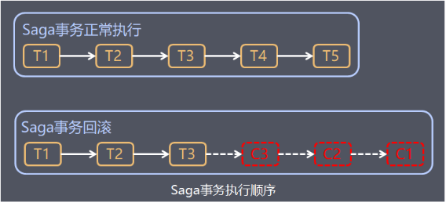
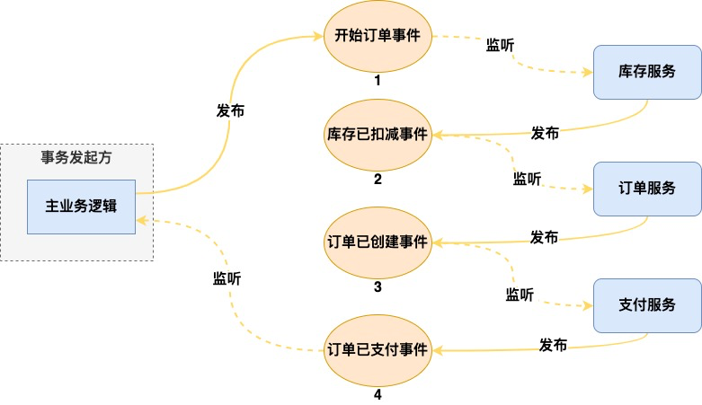
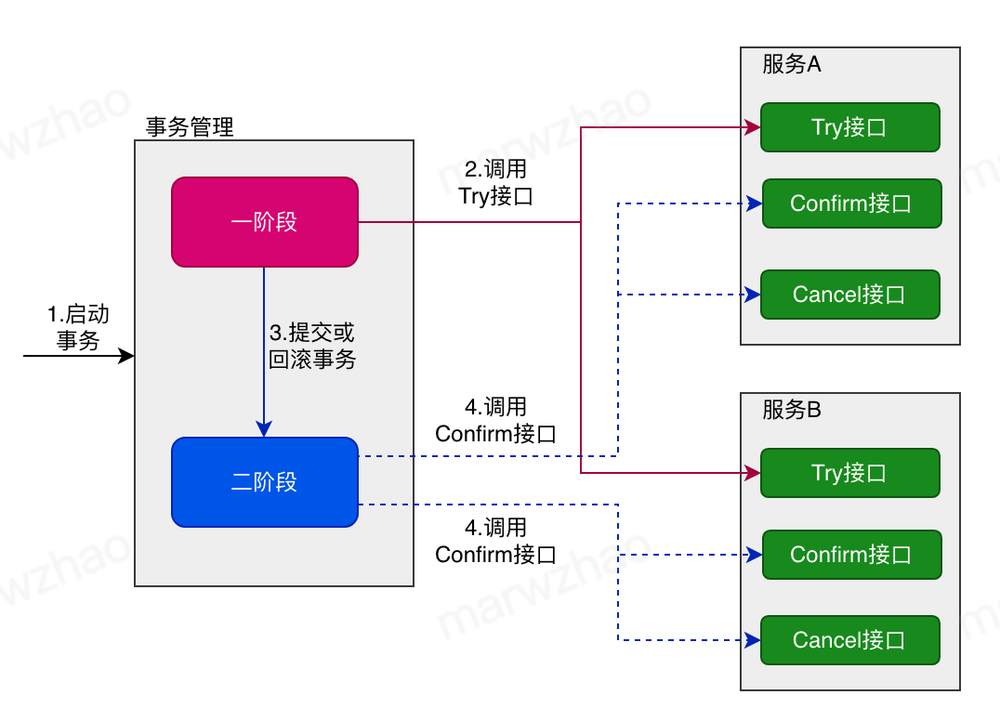
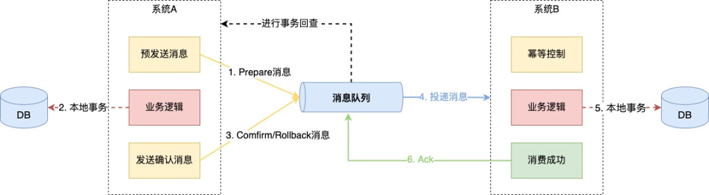

<!--
 * @Author: shgopher shgopher@gmail.com
 * @Date: 2025-04-16 16:26:32
 * @LastEditors: shgopher shgopher@gmail.com
 * @LastEditTime: 2026-02-26 16:59:40
 * @FilePath: /luban/系统设计基础/分布式/分布式组件/分布式事务/README.md
 * @Description: 
 * 
 * Copyright (c) 2025 by shgopher, All Rights Reserved. 
-->
# 分布式事务
核心目标是**数据一致性**确保一个业务操作 (可能涉及跨多个服务、多个数据库、多个数据分片) 中的所有参与者要么**全部**成功提交，要么**全部**失败回滚，即使在部分节点失败的情况下也要保证这种原子性。它解决的是**跨多个独立资源操作的原子性问题**。
> 这里谈论的一致性指的是事务的完整性，而不是数据的一致。

作用于一个完整的业务逻辑单元，这个单元可能包含多个子操作，这些子操作分布在不同的服务或数据存储上。相较于分布式锁，**分布式事务的范围更大、更抽象**。

## 事务的基本概念
所谓事务指的就是要么事件成功，要么失败，所有的中间状态都不能存在，即不能存在成功一半的情况。分布式事务是众多本地事务组成的。

那么我们再重温一下单机事务的 ACID 属性：
- 原子性：即事务的结果是原子性的，只有两个结果，要么成功，要么失败。
- **一致性**：事务操作前后，数据的完整性保持一致或满足完整性约束，比如两个人转钱，那么钱的总数必定是不变的。
- 隔离性：两个不同的事务之间不能相互干扰，任何事务之间的操作都不能干扰到其它事务的执行结果。
- 持久性：事务执行之后是持久的，该记录被永远保存不能丢失。

不过，分布式事务中，一致性并不能完全实现，我们使用 BASE 理论之后强一致性就会转化为最终一致性或者弱一致性。这是因为在分布式的环境中，数据众多，要想实现强一致性势必影响整体的性能。

## 使用 go 语言的中间件 gorm 去实现一个事务
### gorm 的手动事务
```go
  type user struct {}
      ID   int64
      Name string
  }
  // 开始事务
  tx := db.Begin()
  //事务执行
  tx.Create(&user)

  //
  ///
  // 如果失败，事务的回滚
  tx.Rollback()
  // 成功就提交事务
  tx.Commit()
```
### gorm 的自动事务
```go
  db.Transaction(func(tx *gorm.DB) error {
    if err := tx.Create(&user{ID:12,Name:"liming"}).Error; err != nil {
      return err // 如果有错误，事务会自动回滚
    }
    return nil // 如果没有错误，事务会自动提交
  })
```
### gorm 的事务嵌套
```go
  db.Transaction(func(tx *gorm.DB) error { 
    if err := tx.Create(&user{ID:12,Name:"liming"}).Error; err != nil {
      return err // 如果有错误，事务会自动回滚
    }
    // 嵌套事务
     tx.Transaction(func(tx2 *gorm.DB) error {
      if err := tx2.Create(&user{ID:13,Name:"zhangsan"}).Error; err != nil {
        return err // 如果有错误，事务会自动回滚
      }
      return nil // 如果没有错误，事务会自动提交
    })
    return nil // 如果没有错误，事务会自动提交
  })
```
### gorm 的事务保存点
```go
  db.Transaction(func(tx *gorm.DB) error {
    if err := tx.Create(&user{ID:12,Name:"liming"}).Error; err != nil {
      return err // 如果有错误，事务会自动回滚
    }
    // 设置保存点
    tx.SavePoint("savepoint1")
    if err := tx.Create(&user{ID:13,Name:"zhangsan"}).Error; err != nil {
      tx.RollbackTo("savepoint1") // 回滚到保存点
      return err // 如果有错误，事务会自动回滚
    }
    return nil // 如果没有错误，事务会自动提交
  })
```
## 在 clean 架构中去使用事务


1. 模型层（Model）: 模型会在每一层中使用，在这一层中存储对象的结构和它的方法，就是把每一内层让外层使用的接口统一写在一起。
2. 控制层(Controller): 控制层接收 HTTP 请求，并进行参数解析、参数校验、逻辑分发处理、请求返回这些操作。控制层调用业务层，进行真实的业务处理；
3. 业务层(Biz): 业务层主要用来完成业务逻辑处理，业务层会调用仓库层进行数据的 CURD 操作；
4. 仓库层(Store):仓库层用来跟数据库／第三方服务进行 CURD 交互，作为应用程序的数据引擎进行应用数据的输入和输出,仓库层不封装任何业务逻辑。

2 -> 3 -> 4 之间的调用是单向的，2 层只会调用 3 层，3 层只会调用 4 层。

1层是一个凌驾层，它是各个层接口的集合，这个主要是为了写代码方便，理论上是不存在这个层的。


那么，应该在哪一层去具体实现事务的操作呢？

首先我们试试在最内层也就是store层去实现
```go


```

## 分布式事务的具体实践
分布式事务的主要分类是下面几种
### 强一致性 (强事务性) 协商型：事务性较强，几乎任何时间态下事务都表现出严谨性，「 2PC， 3PC ， XA 」


两阶段提交 (2PC) ​​：通过协调者与参与者协作，分 “准备-提交” 两阶段实现原子性。2PC 是 XA 协议所采用的基础算法。

三阶段提交 (3PC) ​​：在 2PC 基础上增加超时机制，降低阻塞风险。

XA ：XA 协议是分布式事务的扩展协议，XA 协议基于 2PC 协议，在 2PC 协议的基础上增加了超时机制，
  使得分布式事务在协调者或参与者发生故障时能够更好地处理事务的提交和回滚。

> 强一致性共识协议 paxos，raft​​：(代价：牺牲可用性 A 保留一致性 C；CAP 定理中的 C 与 A 冲突)跟强事务性分布式事务拥有类似的算法原理


### 补偿型：最终实现事务性，中间态不承诺事务，「 TCC ，SAGA 」

最终一致性模型 ​​：(优势：提升系统可用性，但需容忍短暂不一致)

补偿事务 (Saga) ​​：通过逆向操作回滚已完成的子事务，例如订单取消后自动退款。



saga 又因为不同的方案分为如下两个模式，其一就是编排模式，也就是说将整个流程进行任务的编排排序，其二就是协调模式由一个saga协调者进行整体的规划与协调




TCC 模式 (Try-Confirm-Cancel) ​​：通过预留资源、确认执行、取消补偿三个阶段平衡一致性与性能。
  - Try：尝试预留资源，需幂等并防止悬挂（如超时后Cancel先到，后续Try应拒绝）。
  - Confirm：所有Try成功后，执行最终提交，需保证幂等。
  - Cancel：任一环节失败时，回滚Try操作，需**幂等**并支持空回滚（如Try未收到，Cancel仍成功）
  
  
  
### 消息表型：事务主动方设置消息表，事务被动方消费消息表，「 本地消息表，MQ 」
本地消息表


本地消息表的方案是这样的，有事务发起方将操作记录到本地数据库中，并记录状态，然后将消息发送到mq中，事务被动方接收消息，并执行操作，如果成功就给事务发送方回执消息说明自己是成功还是失败，事务发送方就可以根据是否成功来确认操作是否成功，并更改本地数据库中的状态，以及自己的操作。

- 事务主动方，需要额外建一个消息表，并记录消息发送状态。消息表和业务数据要在一个事务里提交，要在一个数据库里面。然后消息会经过MQ发送到消息的消费方。如果消息发送失败，可进行重试发送或通过定时任务发送到MQ

- 事务被动方，需要消费消息，并完成自己的业务逻辑。此时如果本地事务处理成功，表明已经处理成功了，如果处理失败，那么就会重试执行。如果是业务上面的成功，可以给事务主动方发送一个业务消息，通知事务主动方标记或删除事务消息，需要可重入

异步消息队列 ​​：利用消息中间件 (如 Kafka) 保证操作最终执行，适用于高吞吐场景。
!


mq模式其实就是将本地消息表中的消息表内置到了mq中，这种方案少了数据库这个组件。基本逻辑是相同的。

- 发起方发送**半事务消息**会给消息队列 ，此时消息的状态prepare，接受方还不能拉取到此消息

- 发起方进行本地事务操作

- 发起方给消息队列确认提交消息，此时接受方可以消费到此消息了
### 佛系型：业务主动方发送消息，成不成功都行，事务被动方接收消息，但保留询问的通道 「 最大努力通知 」

- 不可靠消息：业务主动方，在完成业务处理之后，向业务活动的被动方发送消息，直到通知N次（时间退避）后不再通知，允许消息丢失(不可靠消息)

- 定期校对：业务被动方，根据定时策略，向业务活动主动方查询(主动方提供查询接口)，恢复丢失的业务消息


很明显，在处理没那么重要的通知时，可以使用这种方式，业务主动方发送消息，成不成功都行，事务被动方接收消息，**但保留询问的通道。**
### 对比
| 类型| 典型模式| 一致性模型| 特点 |
|---|----|---|---|
| 强一致性事务| 2PC, 3PC, XA | 强一致性 （强事务性）| 同步阻塞，适合单机房、数据库层事务         |
| 补偿型事务| TCC, SAGA | 最终一致性（弱事务性，中间态可以不事务）   | 业务侵入高，灵活，适合微服务 |
| 可靠消息型| 本地消息表、事务消息（如RocketMQ）| 最终一致性（弱事务性）   | 依赖MQ，保证消息不丢 |
| 最大努力通知| HTTP/MQ通知 + 回查 | 尽力而为 | 不保证成功，适合非核心业务|

## 在分布式事务中分布式锁的运用

分布式锁 ​​：在并发场景下通过锁机制保证隔离性，如 Redis 分布式锁

在基于 TCC (Try-Confirm-Cancel) 模式的分布式事务中，Try 阶段可能需要预留资源。在执行 Try 操作 (如冻结库存、预扣款) 时，为了防止同一个资源被多个并发事务同时预留 (导致超卖或超扣)，就需要在操作具体的库存记录或账户余额记录之前，获取一个针对该特定资源项 (如特定商品 ID 的库存行、特定用户 ID 的账户行) 的分布式锁。

在基于 2PC (两阶段提交) 模式的分布式事务中，事务协调器在准备阶段收集所有参与者的投票结果时，如果协调器本身是集群部署的，那么选主或者协调状态变更时，可能需要分布式锁来保证只有一个协调器实例在活动状态，或者保证状态变更的互斥性。

说白了，**分布式锁仅仅是分布式事务的一个工具而已，跟其它场景中的运用没有任何的区别。**

不过，分布式锁本身可能需要 “小事务”：在实现分布式锁时 (尤其是在使用数据库实现时)，获取锁和释放锁的操作本身可能需要具有原子性。这通常通过数据库的本地事务 (ACID 事务) 来实现。

不能用分布式锁直接实现一个跨多个数据库更新的原子性提交 (这是分布式事务的核心目标)。

你也不能用分布式事务直接实现细粒度的、长时间的资源互斥访问 (分布式锁的核心目标)。分布式事务通常**持续时间较短** (涉及多个资源的协调开销大)，而锁可能需要**持有较长时间** (比如处理一个耗时任务)。

分布式锁和分布式事务是解决分布式系统中不同层面问题的两种工具。它们本质不同，但在构建复杂分布式应用时经常结合使用。分布式事务的参与者内部在操作共享资源时，常常需要依赖分布式锁来保证该资源操作的互斥性

通常，**分布式锁是更底层、更细粒度的同步原语**，而**分布式事务则是在更高层面协调多个操作** (其中可能包含需要锁保护的子操作) 的原子性。
## 分布式事务实战
### 本地共享内存机制

### 检测存储binlog/oplog

### 消息队列

### 幂等可重入

## 分布式事务综合演练
- 前端引入token机制用来避免重复提交，引入全局唯一 id 设计，订单id
- 后端使用 MQ分布式事务以及 saga 补偿式分布式最终事务


## 为什么在微服务架构中 tcc和taga的使用率更高一点
在分布式事务的解决方案中，2PC（两阶段提交）、3PC（三阶段提交）、TCC（Try-Confirm-Cancel）、Saga和消息队列（MQ）各有特点。

尽管如此，TCC和Saga模式近年来受到了特别的关注，尤其是在处理复杂的微服务架构时。以下是一些原因解释为何大家普遍倾向于选择TCC和Saga，尤其是Saga

TCC模式的优势

高灵活性：TCC允许开发者精确控制每个业务操作的尝试、确认和取消逻辑，这使得它非常适合那些需要精细控制事务流程的场景。
高性能：与传统的2PC相比，TCC避免了全局锁的问题，因为它直接管理资源的锁定和释放，从而提供了更好的性能表现。

Saga模式的优势

长期运行事务的支持：Saga非常适合处理长时间运行的事务，因为它通过一系列本地事务来完成整个业务流程，并为每个本地事务定义相应的补偿操作以便在发生错误时进行回滚。

减少锁的使用：与2PC或3PC不同，Saga模式通常不使用全局锁，这有助于提高并发度并降低死锁的可能性。

适应性强：Saga模式可以灵活地处理不同的业务需求和异常情况，因为每个步骤都可以定义自己的补偿逻辑，使得其能够更好地适应复杂的业务场景。

易于理解和实现：相对于2PC/3PC，Saga模式的概念更加直观，实现起来也相对简单，特别是在处理失败恢复和部分成功的情况时。

**为什么Saga更受欢迎？**

对现有系统的影响较小：Saga模式可以在不影响现有系统设计的情况下集成到已有的应用中，因为它主要依赖于本地事务及其补偿逻辑。

应对复杂性：随着微服务架构的普及，业务逻辑变得越来越复杂，Saga提供了一种有效的方法来管理和协调跨多个服务的操作。

故障处理能力强：Saga允许为每个步骤定义补偿逻辑，这对于构建容错性强的应用程序至关重要。
综上所述，虽然每种分布式事务解决方案都有其适用场景，但TCC和Saga因其灵活性、性能优势以及对现代微服务架构的良好适应性而受到青睐。特别是Saga模式，由于其强大的故障处理能力和对复杂业务逻辑的支持，在很多实际应用场景中显得尤为突出。

## 实践中使用率对比

- Saga 和 TCC 在微服务架构下非常流行，尤其是当涉及到跨多个服务的分布式事务时。Saga 因其灵活性和较低的实现复杂度而被广泛采用，尤其是在电商、物流等领域；TCC 则更常见于资金转移、库存管理等对数据一致性有严格要求并且流程较短的业务场景。


***真实的 Saga 案例：电商下单（库存+支付+优惠券+积分）***

**必须原子完成的业务**：用户下单时，这四个操作必须"同生共死"——要么都成功，要么都回滚，否则数据错乱。

```
正向流程：
  T1: 扣减库存（提交）
  T2: 扣减用户余额（提交）
  T3: 核销优惠券（提交）
  T4: 增加会员积分（提交）

若 T4 失败 → 反向补偿：
  C3: 恢复优惠券
  C2: 退回余额
  C1: 恢复库存
```

**为什么必须用 Saga**：  
- 4个服务独立部署，无法用一个数据库事务包裹  
- 流程长（4步），TCC 需要 12 次 RPC，Saga 只需 4 次  
- 允许短暂不一致：扣了库存、扣了钱，但积分没加上（用户无感知）


***对比：TCC 的真实场景——银行转账***

```
A 账户转 1000元 到 B 账户（跨行，两个独立服务）

Try:
  └─ A服务：冻结 A 的 1000元（余额不变，可用余额-1000）
  └─ B服务：冻结 B 的待入账 1000元

Confirm:
  └─ A服务：冻结→扣减（正式转出）
  └─ B服务：冻结→入账（正式到账）

Cancel（任一失败）：
  └─ 双方解冻，钱回到原状
```

**必须用 TCC 的原因**：  
- 绝对不能出现"钱扣了但没到账"或"重复到账"  
- Try 阶段冻结，确保 A 的钱不会被其他转账转走（隔离性要求高）


| 模式 | 典型案例 | 核心特征 |
|:---|:---|:---|
| **TCC** | 跨行转账、秒杀扣库存 | **先锁定，后确认**，隔离性强，资金类首选 |
| **Saga** | 电商下单（多服务扣减/增加） | **先提交，后补偿**，性能高，流程长类首选 |

- MQ 模式,通过消息可靠投递 + 消费者幂等，实现 异步的最终一致性, 由于其实现简单、解耦能力强，在构建高并发、异步处理系统中非常普遍。它常用于那些可以容忍一定时间内的数据不一致性的场景，例如日志收集、通知服务等。

Step 1: 订单服务发送"半消息"到 MQ // 半消息：可以理解为能改变内容的临时消息
        └─ 消息对消费者不可见（Half Message）

Step 2: 订单服务执行本地事务（创建订单）
        ├─ 成功 → 向 MQ 发送 Commit，消息变为可消费
        └─ 失败 → 向 MQ 发送 Rollback，消息删除

Step 3: 若 Step 2 无响应，MQ 主动回查订单服务
        └─ 根据订单是否存在，决定 Commit/Rollback

Step 4: 仓库服务消费消息，执行发货
        └─ 消费失败 → 重试（幂等保证不重复发货）


| 模式       | 典型案例               | 核心特征            |
| :------- | :----------------- | :-------------- |
| **TCC**  | 跨行转账、秒杀扣库存         | 同步，强隔离，3阶段锁定    |
| **Saga** | 电商下单（订单+支付+优惠券+积分） | 同步，长流程，反向补偿     |
| **MQ**   | 下单后异步发货、支付成功发短信    | 异步，最终一致，无回滚，靠重试 |

## 参考资料
- https://xqey620khg.feishu.cn/docx/RAPmde56Pojc4QxgLrtc1Ga7noe?from=from_copylink
- https://mp.weixin.qq.com/s/0Io-X0S9AY-s0HeRb_jbag

