<!--
 * @Author: shgopher shgopher@gmail.com
 * @Date: 2024-12-07 14:31:03
 * @LastEditors: shgopher shgopher@gmail.com
 * @LastEditTime: 2024-12-21 17:53:01
 * @FilePath: /luban/系统设计基础/架构安全性/架构安全性/传输/README.md
 * @Description: 
 * 
 * Copyright (c) 2024 by shgopher, All Rights Reserved. 
-->
# 传输
## 摘要
摘要，也叫做数字摘要值，当我们使用哈希函数对某个值进行计算得出的数据就是摘要值。摘要值是一个固定长度的哈希值，用来验证数据的真实性。

比如我们对密码和盐进行计算，就可以使用哈希函数得出一个固定长度的摘要值，注意再次强调一次，摘要值是固定长度的。

你也可以把摘要理解为哈希函数的值。

理想的哈希函数具有易变性，即使输入的数据只有一点点的变化，输出的哈希值也会有很大的变化。比如你下载的某个文件都会附带一个哈希值，用来计算下载的文件是否被篡改，按照它给你的哈希函数计算出来的哈希值和你下载的文件的哈希值进行比较，如果不一样，那么说明文件被篡改了。

第二，哈希函数的值也就是摘要具有不可逆性，摘要的过程是单向的，不能从摘要中恢复原始数据。
## 加密
加密和摘要最大的区别是，摘要是不可逆的，而加密是可逆的。

现在密码学的加密方法都是公开的，现代密码学的保密性不依靠加密算法的隐蔽性，而是靠计算的复杂度上，算法按照输入端计算出结果就需要非常少的资源，但是根据输出结果倒推输入就需要耗费巨大的资源。

比如，大数的质因数分解
```bash
988449949 * 43344343 = 42843713627788507
```
这个过程是非常容易的，但是如果一个很大的数，去分解它的质因数，那就需要耗费很多的资源。

### 对称加密
加密和解密使用的是同一个密钥，这种加密方式叫做对称加密，对称加密的优点是加密和解密速度快，缺点是密钥的传输是一个问题，当通信的成员数量增加时，为了保证两两通信都需要独立的密钥，密钥的数量就需要和成员的数量成正比，这样就会导致密钥的管理变得非常复杂。更难的是，当通信双方本来的传输信道就不安全的话，如果将只有双方才知道的密钥传输给对方呢

在对称加密中，密钥的传递是一个关键问题。如果只是成员自己私下复制和保存密钥，这在一些简单的、固定成员且成员之间信任度极高的小范围场景下可能看似可行。但是在实际的复杂通信环境中，比如一个大型的企业网络或者互联网通信中，这是很难实现的。因为在这种情况下，密钥的传递就需要通过网络传输，而网络传输是不安全的，如果密钥在传输过程中被截获，那么通信的内容就会被泄露。
### 非对称加密
非对称加密的意思就是有两个密钥，一个是私有的叫做私钥，一个是公开的叫做公钥，根据使用方法不同可以分为两个作用

- **公钥加密，私钥解密**：加密数据，使用公开的公钥加密数据，只有私钥才能解密数据
- **私钥加密，公钥解密**：签名 (验证数据发起人的身份) 私钥加密的是要鉴权人的哈希摘要，使用私有的私钥加密数据，而公钥大家都知道，我们就是验证数据发布人的身份，并不是为了解密数据。

通过 a 想向 b 发送一个保密的数据，a 先用 b 的公钥加密数据，然后在用自己的私钥加密这段加密后的数据，然后发送给 b，b 收到数据后，先用 a 的公钥解密 (确定是 a 发送的)，再用自己的私钥解密 (获取真实数据)，得到原始数据，这样保证了内容不被读取也不会被篡改。

双加密的目的：身份认证，先使用 B 的公钥加密，再用 A 的私钥加密的过程中，能够实现双向的身份认证。

当 B 收到消息后，先用 A 的公钥解密 (这一步可以验证消息是否是 A 发送的，因为只有 A 的公钥才能正确解密用 A 的私钥加密的数据)，再用自己的私钥解密。这样 B 可以确定消息来自 A，并且只有自己能够最终解密消息，保证了通信双方身份的可靠性。

防止信息篡改方面：这种双重加密的方式可以提供更高的安全性。如果只是使用 A 的公钥加密，攻击者可能会截获加密后的消息，虽然没有 A 的私钥无法解密内容，但攻击者可以用自己的公钥和私钥对消息进行替换或者篡改。例如，原始消息是 “明天下午三点开会”，C 将其截获后，用自己的公钥对 “会议取消” 这个消息进行加密，然后把加密后的 “会议取消” 消息发送给 B。B 收到这个消息后，由于 B 并不知道这个消息已经被 C 替换，会尝试用 A 的公钥来解密 (当然无法解密成功，因为消息是用 C 的公钥加密的)，但这会造成通信内容被恶意篡改的情况。

**关于篡改是否成功的理解误区：**在这个场景中，从解密的角度看，B 确实无法用 A 的公钥解密出 C 用自己公钥加密后的消息。但是从通信的完整性和真实性角度来说，篡改已经成功了：无法获取原始的正确信息，整个通信过程被干扰，信息传递出现错误

而采用双重加密，即使攻击者截获了用 A 的私钥加密后的消息，由于没有 B 的私钥，也无法进行正确的解密和篡改操作。


### 混合加密
单靠非对称加密，其实做不了加密也做不了签名。

因为非对称加密的计算复杂度非常的高，性能比对称加密差了好多个数量级。

加解密性能不仅影响速度，还导致了现行的非对称加密算法都没有支持分组加密模式，分组是指，长的密钥决定了它能加密多长的明文，如果明文太短就需要进行填充，太长就需要进行分组，因非对称加密本身的效率所限，难以支持分组，所以主流的非对称加密算法都只能加密不超过密钥长度的数据，这决定了非对称加密不能直接用于大量数据的加密。

当我们在使用私钥加密公钥解密 (验证身份)，公钥加密私钥解密 (加密数据) 的时候，我们传递的数据是**对称加密的密钥**，使用这种非对称加密和对称加密相结合的方法就是混合加密。

在签名方面，现在一般会结合摘要 (哈希摘要) 与非对称加密的优点，以对摘要结果做加密的形式来保证签名的适用性，由于对任何长度的输入源做摘要之后都能得到固定长度的结果，所以只要对摘要的结果进行签名，**即相当于对整个输入源进行了背书**，保证一旦内容遭到篡改，摘要结果就会变化，签名也就马上失效了。

### 加密算法对比

|加密类型|特征|常见加密算法|用途|局限性|
|---|---|---|---|---|
|哈希摘要|不可逆，不是加密算法，是属于数据摘要，不管输入多少，输出都是固定的数据，稍有改变，输出就改变巨大|MD5 SHA1 SHA256 SHA512|数据摘要|无法进行逆运算（无法进行解密）|
|对称加密|加密的过程只有一个密钥，设计难度小，运算效率高，加密的明文长度不受限制|DES AES RC4 IDEA|加密数据|要解决加解密双方通信密钥的安全问题|
|非对称加密|加密和解密不是同一个密钥，加密的数据长度不能超过公钥的长度|RSA BCDSA EIGmmal|签名（鉴定身份），传递密钥|性能很差，加密的数据长度受限|

## 数字证书
我们并不能假设授权服务器和资源服务器互相认识，所以我们需要一个权威公证人来作为信任大拿。这个大佬就是公开密码基础设施，它凭借着数字证书认证中心将用户的个人身份和公开密钥联系在一起。

权威公证人负责发送和管理数字证书，它作为受信任的第三方，承担公钥体系中公钥的合法性检验的责任，

CA 使用自己的私钥对服务端的公钥和相关信息 (如服务端的域名等) 进行数字签名，生成数字证书，浏览器存储的是完整的 CA 根证书 (包含 CA 公钥) 用来验证服务端的公钥是否合法。这一步相当于去公安局做生意，只要发现确实是公安局的人给你的钱，大概率一定是真钱。

所以我们是先持有 CA 的公钥然后验证 CA 的私钥加密后的数据，然后证明这个数据是可以信任的，然后这个数据本身是要沟通的服务器的公钥及其它内容，这里的数据就是证书。

权威认证中心将权威数字证书 (这里值得是 CA 的公钥，别搞错了，不是服务器的证书) 直接内置在浏览器或者操作系统中，这样就可以保证用户的公钥是合法的。而且这个过程根本不涉及到网络的传输，所以可以保证传输的私密性。

数字证书就是一种权威性的附加了很多信息 (比如发布机构，证书有效期等信息) 的公钥，主要数据包括：

- **公钥信息**：包括证书持有人的公钥，算法等密钥参数
- 版本号，指出证书使用的哪个版本的 x.509 标准 (目前最新的版本是 3，有 1 2 3 三个版本) ` Version: 3(0x2)`
- 序列号：由证书颁发这分配的本证书的唯一标识符
- 签名算法标识符，用于签发证书的算法标识，用于说明本证书所用的数字签名算法，比如 `sha1WithRSAEncryption` 就是说明利用 RSA 对 sha1 哈希值进行签名的算法。`Signature Algorithm: sha1WithRSAEncryption`
- 认证机构的数字签名，这是使用证书发布者私钥生成的签名，用于确保该证书没有被篡改
- 证书发布者的名称，即证书发布机构的名称
- 有效期，证书的有效期，包括证书的起始时间和结束时间
- 主题信息，证书持有人唯一标识符，标识该名字，互联网唯一性，比如域名
## 传输安全层
如果要实行传输的安全，那么我们需要什么步骤呢？
加密算法，生成密钥，公钥的分发，CA (权威公证人) 认证，校验公钥，校验签名，验证数据，这些步骤都是必不可少的。

为了保证体验的简单性，我们将这个过程包装成了一个安全层，这个层在 tcp 传输层之上，http 应用层之下，这个层就是传输安全层，简称 TLS。



### Client Hello：客户端请求
客户端向服务器要求进行加密通信，它会以明文的方式向服务器发送下面的信息
- 它支持的协议，比如 tls1.2
- 一个客户端生成的 32 bytes 的随机数，这个随机数用于产生加密的密钥
- 一个 sessionID (不是 cookie-session 那个 sessionID)，这个 sessionID 是指的是传输安全层的 session，为了 tls 的连接复用而设计
- 一系列支持的密码学算法 (及其算法组合套件)，比如 TLS_RSA_With_AES_128_GCM_SHA256 表示密钥交换算法是 RSA，加密算法是 AES，加密模式是 GCM，消息认证码的哈希算法是 SHA256
- 一系列的数据压缩算法
- 其他可扩展的信息
### Server Hello：服务端响应
服务器收到客户端的请求后，如果客户端支持的协议版本和加密算法组合和服务端匹配的话，就会向客户端发送回应，如果不匹配就会发送握手失败的提示，同样也是明文消息，包含以下信息
- 服务端确认使用的 TLS 协议
- 第二个 32 bytes 随机数，用户产生加密的密钥
- 一个 sessionID，用于复用连接
- 服务端在列表中选定的密码学算法组合
- 服务端在列表中选定的数据压缩算法
- 其他可扩展的信息
- 如果协商出的加密算法组合是依赖证书认证的，服务端还要发送出自己的 X.509 证书
- 密钥协商消息
### 客户端确认：Client Handshake Finished
我们这里按照 RSA 密钥交换算法来进行分析

客户端收到服务器应答后，先验证服务器的证书的合法性，如果证书不是权威机构发布的，或者证书中信息存在问题，都会显示一个证书不可信任的警告，如果用户选择还要继续，就无视警告，客户端就会取出服务器的公钥，并向服务器发送下面的数据：
- 客户端证书 (可选) 有些服务器并不是面向大众的，只对特定的客户端进行通信，所以客户端必须发送自己的证书来证明身份，这种叫做双向 tls
- 第三个 32 bytes 的随机数，以服务端传过来的公钥进行加密，它将和前两次发送的随机数一起，根据特定的算法计算出 48 bytes 的 master secret，这个 master secret 就是后续内容传输时的对称加密的密钥
- 编码改变通知，标识随后的信息都将双方商定的加密方法和密钥发送
- 客户端握手结束通知
### 服务端确认：Server Handshake Finished

服务端向客户端发送最后的确认通知
- 编码改变通知
- 服务器握手结束通知，这一项是前面发送的数据内容的哈希值，用于验证数据的完整性


采用了不同版本的协议版本，不同的加密套件，证书是否有效，服务端和客户端对无效证书的处理方法，都导致最后的安全性的不同。