<!--
 * @Author: shgopher shgopher@gmail.com
 * @Date: 2024-09-21 23:43:21
 * @LastEditors: shgopher shgopher@gmail.com
 * @LastEditTime: 2024-10-02 23:54:15
 * @FilePath: /luban/系统设计基础/网络在系统设计中的作用/API网关/README.md
 * @Description: 
 * 
 * Copyright (c) 2024 by shgopher, All Rights Reserved. 
-->
# API 网关 (应用网关)
API 网关是所有请求的入口，它接收了所有的 http https tcp 的请求，并将请求转发给后面真正的服务，微服务模式下，这些服务一般都是一些容器，或者也可能是各个数据中心的各自的 API 网关，总而言之，API 网关是一切请求的入口处理工具，它工作相对较少，所以性能非常的高

API 网关通常被部署在后端服务的最前端，来充当安全保护，熔断，限流，等作用，**nginx 就是一个简单化的 api 网关**，不过常见的 api 网关并不是 nginx，比较常见的有 **kong**，**bfe** 等

## API 网关的作用
- **解耦后端架构**：或者说灵活配置后端架构，它将需求和真实处理的服务解耦，可以构建更加灵活多样的后端架构 (BaaS)

- **减少 TLS 协议的使用**，TLS 协议加上 http 组成了 https，但是要知道 https 因为多了一层协议，所以势必比单纯的 http 慢，而且 tls 证书也是要花钱的，如果我们配置了 API 网关只需要在最前端部署 tls 协议即可，BaaS 中的服务都可以使用 RPC 协议或者一般的 http 协议

- **API 网关增加安全性**，可以对入口流量做鉴权，限流，降级，黑名单，白名单等措施，与此同时，后端的服务也仅仅可以放开对于 API 网关的 ip 访问，从而避免了各种安全风险

- **API 网关减少了运维的难度**，所有流量都经过 API 网关，可以做日志记录，监控，统计，这些行为都变得更加简单

- **API 网关可以对流量进行统一更改**，比如对于流量进行 gzip 压缩；可以一次性升级所有服务的协议，它只要升级为 http2 或者 3 这种新的协议，对外的服务就相当于升级了所有服务的协议，因为你入口升级了嘛，后端是什么协议都无所谓了，反正暴漏给客户端的协议是升级了；还可以对数据进行格式的转换，例如 xml 转换为 json 等

## 注册中心和服务发现
服务发现是微服务架构中的一个关键环节，用于帮助各个服务能够互相定位并进行通信。以下是它的原理：

### 服务注册

***服务信息收集***

当一个服务启动时，它首先会**收集自身的相关信息**。这些信息包括服务的名称、IP 地址、端口号、服务协议 (如 HTTP、gRPC 等)、服务版本等。例如，一个名为 “user - service” 的微服务，它的 IP 地址可能是 192.168.1.100，端口号是 8080，使用 HTTP 协议，版本是 v1.0。

***注册中心通信***

服务会将收集到的这些信息发送给一个服务注册中心。**服务注册中心是一个存储所有服务信息的地方**，常见的注册中心有 Consul、Eureka、Zookeeper 等。
以 Eureka 为例，服务通过 RESTful API 与 Eureka Server 进行通信。服务发送一个包含自身信息的注册请求，Eureka Server 收到请求后，会将服务信息存储在其内部的注册表中。**这个注册表是一个数据结构，通常是一个键值对的集合，键是服务名称，值是服务的详细信息列表。**
### 服务发现过程

***客户端请求发现服务***

当一个服务需要调用另一个服务时，它首先会**向服务发现组件发送一个发现请求**。例如，一个订单服务需要调用用户服务来获取用户信息，订单服务就会发起服务发现请求。

***发现组件查询注册中心***

服务发现组件收到请求后，会**查询服务注册中心**。它会根据目标服务的名称在注册中心的注册表中查找对应的服务信息。
假设使用 Consul 作为注册中心，服务发现组件会向 Consul 发送一个 HTTP GET 请求，请求的路径可能是类似 “/v1/catalog/service/user - service”，Consul 会返回用户服务的 IP 地址、端口号等信息。

***缓存机制***

为了提高性能，很多服务发现系统会使用缓存。服务发现组件在获取服务信息后，会将信息缓存起来。这样，在一定时间内 (缓存有效期内)，如果有相同的服务发现请求，就可以直接从缓存中获取信息，而不需要再次查询注册中心。

例如，一个缓存的有效期设置为 30 秒，在这 30 秒内，所有对某个服务的发现请求都可以直接使用缓存中的 IP 地址和端口号，减少了与注册中心的交互次数，提高了效率。

***返回服务信息给客户端***

服务发现组件将从注册中心 (或者缓存) 获取的目标服务信息返回给客户端。客户端得到目标服务的 IP 地址和端口号后，就可以根据这些信息建立与目标服务的连接，并发起服务调用。例如，订单服务得到用户服务的 IP 地址和端口号后，就可以使用 HTTP 协议向用户服务发送请求，获取用户的详细信息。

***服务信息更新与同步***

**注册中心会定期检查服务的健康状态**。如果一个服务因为故障或者网络问题等不可用了，注册中心会将其标记为不可用状态，并且在服务发现时不会返回这个不可用服务的信息。
同时，当服务的信息 (如 IP 地址因为重新部署而改变、服务版本升级等) 发生变化时，**服务会主动向注册中心发送更新请求**。注册中心会更新注册表中的信息，并且通过合适的机制 (如推送通知或者客户端定期查询) **将更新后的信息同步给服务发现组件**，以确保服务发现的信息始终是准确的。
### 服务发现组件是怎么知道要调用哪个服务的呢？
服务发现组件知道要调用哪个服务是由程序员通过服务名称的指定、配置文件设置或者编程接口使用等方式来**主动控制的**

当新的服务组件注册到注册中心时，如果注册中心具有推送功能，它会尝试向已注册的服务发现推送更新信息。

