<!--
 * @Author: shgopher shgopher@gmail.com
 * @Date: 2024-09-15 17:04:57
 * @LastEditors: shgopher shgopher@gmail.com
 * @LastEditTime: 2024-10-08 23:54:30
 * @FilePath: /luban/系统设计基础/网络在系统设计中的作用/SDN/README.md
 * @Description: 
 * 
 * Copyright (c) 2024 by shgopher, All Rights Reserved. 
-->
# sdn
(sdn software defined network) 软件定义网络，它将网络控制平面和数据层面分离，这里面有一个重要的技术 lvs 它就是三层负载均衡，二层负载均衡的运用。

**其核心技术就是 LVS**
## lvs 基本原理
通过修改七层网络中的数据链路层的 mac 协议，网络层的 ip 协议，实现了交换机 (处理 mac 协议) 网关 (处理 ip 协议) 的数据包转发。从而将数据转发到真正的服务器上。

lvs 有四种模式

- NAT 模式 (三层负载均衡)
- FULL-NAT 模式 (三层负载均衡)
- TUN 模式 (二层负载均衡，部分三层负载均衡)
- DR 模式 (二层负载均衡)

只有仅有二层负载均衡的就只能用在内网中，因为没有 ip 识别是无法在公网中使用的。

只有涉及到了三层负载均衡，就能用在公网中，所以显而易见的，DR 模式最底层，性能最高，但是只能用在内网中
### NAT 模式

### FULLNAT 模式

### TUN 模式

### DR 模式

由于需要更改目标 mac 地址，这就意味着该负载均衡器必须与真实的服务在 mac 层能建立通信，所以这就意味着它只能运行在内网中
## keepalived
## 更多优化方法

