<!--
 * @Author: shgopher shgopher@gmail.com
 * @Date: 2024-09-15 17:04:03
 * @LastEditors: shgopher shgopher@gmail.com
 * @LastEditTime: 2024-10-03 00:11:20
 * @FilePath: /luban/系统设计基础/网络在系统设计中的作用/负载均衡/README.md
 * @Description: 
 * 
 * Copyright (c) 2024 by shgopher, All Rights Reserved. 
-->
# 负载均衡
一共分为七层网络模型，分别是

- 7 应用层：http
- 6 表达层
- 5 会话层
- 4 传输层：tcp
- 3 网络层：ip
- 2 数据链路层：wifi
- 1 物理层：物理网卡

## 四层负载均衡
四层负载均衡的意思是指的是这些负载均衡的工作模式特点是维持同一个 tcp 连接，并不是第四层的负载均衡，但是其实做负载均衡的是在第二层和第三层
### 二层
数据链路层传输的内容是数据帧，我们这里讨论的是以太网帧，其中以太网帧还有很多的数据，我们关注 MAC 目标地址和 Mac 源地址，每一块网卡都有一个专属直接的 Mac 地址，以太帧会告诉交换机此连接从哪个网卡来的到哪个网卡去的。

链路层要做的转发就是将目标帧的 MAC 地址给修改了，对于三层来说，根本察觉不到，这才是真的转发，而不是代理

只要真实服务器的 ip 地址保证跟数据包中的 ip 地址一致，数据就可以被转发

我们要做的就是将真实物理服务器所在的虚拟 ip 地址配置成跟负载均衡器的虚拟 ip 一致即可
> 虚拟 IP 地址的实现方式通常是通过软件来进行配置和管理。例如，在网络设备、服务器操作系统或者负载均衡软件中，可以设置虚拟 IP 地址，并将其与特定的服务或应用程序关联起来。同时，虚拟 IP 地址也需要与网络基础设施进行配合，确保数据包能够正确地路由到对应的服务器上。

这种转发叫做三角模式，因为响应就不需要经过转发器了

二层负载均衡器有个缺点就是只能在**一个子网中使用**，因为它是修改的 mac 地址，这就说明它与真实的服务器通信必须是二层可达的状态。
### 三层
以 ip 协议为例，ip 协议包括 headers 和 payload，其中我们只关注 headers 中的源 ip 和目标 ip

三层负载均衡有两种转发模式

第一种，保持原来的数据包不变，新创建一个包，将原来包的 headers 和 payload 作为另外新包的 Payload 内容，在新包的 headers 中写入真实的服务器 ip 作为目标 ip，然后在达到目标服务器之后，再进行拆包动作

这种模式仍必须通过专门的配置，必须保证所有的真实服务器与均衡器有着相同的虚拟 IP 地址

NAT 模式：也可以直接替换 header 中的目标 ip，不过这样的话，这个转发器就不能取消了，必须充当中间人的身份了，服务器返回的内容中源 ip，客户端可不认识啊。客户端只认识中间的转发器，所以不能取消

还有一种更加彻底的 NAT 模式：即均衡器在转发时，不仅修改目标 IP 地址，连源 IP 地址也一起改了，源地址就改成均衡器自己的 IP，但是这样有一些需要根据目标 IP 进行控制的业务逻辑就无法进行
## 七层负载均衡
只有二三层属于数据的转发，到 tcp 之后都属于代理，因为 tcp 协议之后的内容都已经到了目标服务器了，是无法再进行转发数据的。

转发是指的【用户】【四层负载均衡】【服务器】之间是一个通道，代理是用户和七层负载均衡一个通道，七层负载均衡和服务器之间一个通道

### 七层负载均衡的能力
- 静态资源缓存，协议升级，安全防护，访问控制，这种 cdn 能做到的事，七层负载均衡也可以做到，毕竟都是加一层保护膜对吧
- 可以实现更加智能，更加多样的路由
- 使用反向代理去防止攻击
- 微服务中的链路治理都需要在七层负载均衡中去做 (通常是 API 网关，nginx 也算 api 网关但是跟专业的比治理方面功能性差很多) 比如服务降级，熔断，异常注入等内容
### 负载均衡算法
- 轮询
- 权重轮询，就是虚拟化服务器，权重大的服务器数量上就会变多
- 随机
- 权重随机
- 一致性哈希，其实就是权重轮询，但是环形结构，只有在环形结构上与该节点相邻的部分数据需要进行重新分配，而不是像传统哈希算法那样需要对所有数据进行重新计算和分配。
- 响应速度均衡，根据服务器响应时间，将请求分配到响应时间快的服务器上
- 最少连接，将请求分配到连接数最少的服务器上
## nginx 实现七层负载均衡器
nginx 的配置文件 nginx.conf

我们配置假设一台负载均衡器 nginx 后面有三个服务：/get0 /get1 /get2

```nginx
# nginx 配置 /get0 /get1 /get2
worker_processes 3; # 标识服务器进程数

events {

worker_connections 1024; # 标识单个worker进程能同时处理的最大连接数

}

http { # 标识http块

keepalive_timeout 60;# 标识服务器和客户蹲连接超过60秒没有行为就会断掉

upstream get0{ # 标识upstream块
        server 192.168.1.209:8080; # 标识upstream块中的server
        server 192.168.1.209:8081; # 192.168.1.209:8081/get0 提供服务，就是nginx的路由要跟提供服务的服务路由一致才可以
        }

upstream get1{
        server 192.168.1.209:8082;
        server 192.168.1.209:8083;

        }
upstream get2{
        server 192.168.1.209:8084 weight=1; # 配置权重，权重越大被访问的几率越高
        server 192.168.1.209:8085 weight=3;

        }
        
server { # 标识server块
          listen 80; # 标识监听端口
          server_name 192.168.1.209; # 标识服务器名
        
        
        location /get0 { # 标识location块
                proxy_pass http://get0; # 标识代理目标
                }

        location /get1 {
                porxy_pass http://get1; 
                }
        location /get2 {
                proxy_pass http://get2;
              }
        }
}
```
nginx 配置中，nginx 的路由要跟提供服务的服务器路由保持一致，不过也有不一致的方法，比如：

```bash
   location /get0 {
       proxy_pass http://get0/api/get0;
   }
```
这种方法中，如果访问 nginx 的路由 /get0 那么它就会默认去寻找 192.168.1.209:8080/api/get0 或者 192.168.1.209:8081/api/get1

不过，为了保持简洁性，减少复杂度以及潜在的 bug，为了保证运维的逻辑更加清晰，请保持路由的一致：



### Nginx 常用负载均衡策略
- 轮询，就是你啥都不设置，就是这个策略

- 加权轮询，设置 weight=3，权重越大就越被优先访问，优先级按照权重去配比
  ```nginx
  upstream get0{
        server 192.168.1.209:8080 weight=3;
        server 192.168.1.209:8081 weight=1;
        }
  
  ```
- ip_hash，为每一个用户的 ip 地址的哈希值结果分配服务器，让来自同一个 ip 的请求一直访问同一个服务器，注意这里的策略不能很好的践行负载均衡的理论，而且这里的哈希映射不是一致性哈希
  ```nginx
  upstream get1{
        ip_hash;
        server 192.168.1.209:8082 max_fails=3 fail_timeout=30s;# 设置服务器的故障检测，当连续3次请求失败后，nginx会认为服务器已经挂了，并在30秒内不再访问该服务器
        server 192.168.1.209:8083;
        server 192.168.1.210:8084 backup; # 当所有的主服务器（通过ip_hash分配的正常服务器）都无法处理请求时，备份服务器就会启用
  }
  ```
- least_conn，将请求分配到连接数最少的服务器上
  ```nginx
   # 当有两个策略的时候，通常会一起使用     
  
  # 当有新请求到来时，Nginx 首先会考虑least_conn策略，即找出当前连接数最少的服务器。但在这些连接数最少的服务器中，weight会影响请求分配的概率。
   upstream get2{
         least_conn;
         server 192.168.1.209:8084 weight=1 max_fails=3 fail_timeout=30s;
         server 192.168.1.209:8085 weight=3 max_fails=3 fail_timeout=30s;
     }
  ```
- url_hash，三方库 uginx-upstream-hash，类似于 ip_hash 策略，但是它是对请求的 URL 做哈希运算 (一个是对 ip 地址做哈希，一个是对 URL 做哈希)
- fair，三方库 nginx-upstream-fair，根据每个服务器事例的请求响应时间，失败数，当前请求总量，综合选择一个最轻松的服务器

### Nginx 如何加载三方库
- 确定所需第三方模块
   - 首先要明确你需要使用的第三方 Nginx 模块。例如，如果你需要对请求进行更高级的访问控制，可以考虑使用 ngx_http_auth_request_module；如果想增强缓存功能，可能会用到 ngx_cache_purge 模块。这些模块通常是为了满足特定的功能需求，如安全性、性能优化等。

- 检查模块兼容性
   - 确认模块与你的 Nginx 版本兼容。不同的 Nginx 版本对模块的支持有所不同。你可以查看模块的官方文档或者在相关的开发者社区、论坛中查找模块与 Nginx 版本的兼容性信息。例如，一些新开发的模块可能只支持较新的 Nginx 版本，而旧版本的 Nginx 可能无法正确加载这些模块。
- 下载模块源代码
   - 从可靠的来源获取模块的源代码。通常，模块的官方代码仓库 (如在 GitHub 等平台上) 是最好的选择。例如，如果要下载 ngx_http_auth_request_module，可以访问 Nginx 官方网站或者对应的代码托管平台，找到该模块的源代码下载链接或者仓库地址，然后使用版本控制系统工具 (如 git) 或者直接下载压缩包的方式获取源代码。
- 编译安装 Nginx (包含第三方模块)
  - 方法一：重新编译 Nginx
   如果是自己手动编译 Nginx，需要将第三方模块的源代码放置在合适的位置，通常是在 Nginx 源代码目录的 modules 目录下 (如果没有这个目录，可以创建一个)。然后在配置 Nginx 编译选项时，需要指定包含这个第三方模块。例如，使用 `./configure` 命令配置 Nginx 编译选项时，需要添加类似于 `--add - module = path/to/third - party/module` 的选项，其中 `path/to/third - party/module` 是第三方模块源代码的实际路径。
   配置完成后，使用 make 命令编译 Nginx，再使用 make install 命令安装编译好的 Nginx。这样，新安装的 Nginx 就包含了这个第三方模块。
   
   - 方法二：使用动态模块 (适用于支持动态模块加载的 Nginx 版本)
   对于支持动态模块加载的 Nginx 版本 (如 Nginx 1.9.11 及以上)，首先按照上述步骤下载模块源代码。然后在编译模块时，使用 `ngx_build_module` 工具 (这个工具通常随 Nginx 一起提供) 或者按照模块文档中的特殊编译步骤进行编译。
   编译完成后，得到一个动态模块文件 (通常是以。so 结尾的文件)。将这个动态模块文件放置在 Nginx 的模块目录下 (例如 `/usr/lib/nginx/modules/`)，然后在 Nginx 的主配置文件 (nginx.conf) 中，使用 load_module 指令加载这个模块。例如，`load_module modules/ngx_http_auth_request_module.so`；，这样就可以在 Nginx 中使用这个第三方模块了。
- 配置和使用第三方模块
  - 在 Nginx 的配置文件 (nginx.conf) 或相关的虚拟主机配置文件中，根据模块的功能进行配置。例如，对于 ngx_http_auth_request_module，可以配置如下：
  ```nginx
     server {
         listen       80;
         server_name  example.com;
         location / {
             auth_request /auth;
             proxy_pass http://backend;
         }
         location = /auth {
             internal;
             proxy_pass http://auth - server;
         }
     }
  ```     
  这里通过 `auth_request` 指令使用了 `ngx_http_auth_request_module` 来进行请求的身份验证。不同的第三方模块有不同的配置方法和指令，需要根据模块的文档进行具体的配置和使用。
### Nginx 热更新
- 使用 `ngx_lua` 将 lua 脚本嵌入到 nginx 中，允许编写的 lua 脚本运行在 nginx 中
- `ngx_http_dyups_module`，使用这个模块，去不断的主动访问一个服务注册中心，里面是服务的具体内容，然后生成新的配置


### Ngix 优势
- DNS 服务指向 Nginx，具体服务 IP 跟 DNS 解耦
- 使用 Nginx 做了负载均衡
- 对外只暴漏一个公网 ip，节约 ip 资源，nginx 和具体服务内部通信即可
- 防止业务 ip 暴漏
- 增加了业务服务器的可扩展性
- 提高了整体服务的可用性
- 提高了系统的整体性能
## 负载均衡的高级用法
通常下面的高级用法都部署在七层负载均衡上，因为它更加灵活，设置起来更方便一些，四层负载均衡主要侧重于性能，所以一般不会有非常复杂的设置。

- 红蓝发布，通过在**两个生产环境之间** (红色和蓝色) 切换来实现零停机时间部署
- 金丝雀发布，渐进式发布策略，**逐步将新版本推向生产环境**，只有一部分人会看到新版本，一旦出现问题就回滚旧版本
- 灰度发布，**根据用户的流量特点**，将新版本推送给特定用户，在不影响整体用户体验的情况下进行测试和验证
- 主动调节后端服务压力
- 屏蔽失效的后端服务
### 金丝雀发布和灰度发布的区别

金丝雀发布通常是随机的少量的用户，而灰度发布通常是选取特定特征的人群，比如按照地域按照性别，灰度发布更强调策略，金丝雀更强调随机性

金丝雀发布的人群相对更低，一旦有问题就回滚，主要用于最早期的验证，灰度发布因为选择的是特定人群，所以相对用户是很多的，风险是加大的

**金丝雀发布侧重于技术验证**，**灰度发布侧重于业务验证**


